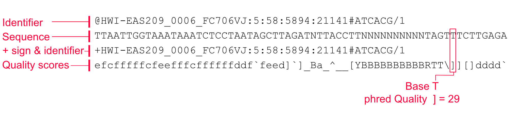

# OUTLINE

This lecture will provide an introduction in the data types and analysis for genomics.
The advent of high-throughput sequencing platforms has resulted in large volumes of data being produced. It important to know how to manage and interpret this data in a reproducible way.

This lecture will cover the following aspects:

1. Sequence data and databases

- Databases and online resources for genomics
- Common sequence data file formats (e.g. `.fastq`, `.fasta`, `.bam`, `fast5`)
- What data is contained in files and how to interpret information

2. Tools for analyzing data

- Tools to query, inspect, visualize sequence files
- Demultiplexing, merging, trimming and quality filtering
- Discuss methods of assembly/clustering in the different contexts of sequence data
    - Amplicon sequencing (clustering/denoising into taxonomic units)
    - Shotgun sequencing (assembling contigs and scaffolds)
- Be familat with both Unix shell and R environment (inc. packages) for sequence data


<!--
In this lecture we will cover data file formats including:`.fastq`, `.fasta`, `.bam`, `fast5`.
We will discuss how they relate to the various sequence platforms and what information they provide.
The lecture will then discuss the following aspects

Assess sequence quality
Map sequence data onto a reference genome
Perform de novo assembly tasks
Quantify sequence data
Integrate biological context with sequence information

1.Sequence data
- Databases and online resources for sequence data
- Learn the common sequence data file formats
- Learn the common sequence data file formats
2.Tools for sequencing data
- Tools to query, inspect, visualize an aligned sequence file
- Learn the contents of sequence data files
- Learn to generate sequencing metrics and to process sequence data
- Learn about Python and R libraries/packages to read sequence data
-->

# Set up

> Important note: lessons outlined here are designed in the context of delivery through the BIO513 unit RStudio/google cloud server.

Please navigate to the RStudio server and login with your details provided earlier in the unit.

Create a new Rmarkdown file by doing to **File > New File > R Markdown ...**

See the [setup](1.setup.html) page for details on obtaining data.

---

## The basics

**Nucleotide notation**

|            |                     |
|------------|---------------------|
| **Letter** | **Nucleotide**      |
| A          | Adenine             |
| C          | Cytosine            |
| G          | Guanine             |
| T (or U)   | Thymine (or Uracil) |
| R          | A or G              |
| Y          | C or T              |
| S          | G or C              |
| W          | A or T              |
| K          | G or T              |
| M          | A or C              |
| B          | C or G or T         |
| D          | A or G or T         |
| H          | A or C or T         |
| V          | A or C or G         |
| N          | any base            |
| . or -     | gap                 |

: IUPAC Nucleotide abbreviations


**N50**

The N metrics are a measure of contiguity of a set of sequences often used to assess genome assemblies.

The N50 is related to the median and mean length of a set of sequences. Its value represents the length of the shortest read in the group of longest sequences that together represent (at least) 50% of the nucleotides in the set of sequences.

**Example: Six reads of length 10, 11, 12, 13, 14, 15, 16. The combined length is 81 nucleotides and 50% = 40.5 nucleotides.**

To get the N50 value start at the longest read and add the length of the next shorter one until you reach (at least) 50% of the total number of nucleotides:

    	16 + 15 + 14 = 45

The N50 value of this set of sequences is 14.

The N50 value can be seen as a weighted midpoint of the read length distribution of a sequencing run. However, the N50 value has to be interpreted in context of the total number of reads in a sequencing run. For example, a large number of very short reads may not have a big impact on the N50 value of a sequencing run but would arguably be worse than a sequencing run with less reads and similar N50 value.

Another common metric is the N90 value, representing the shortest read in the group of longest reads that together represent 90% of all the nucleotides.

In the example above the N90 value is 10.

N50-values alone can be mis-leading are on its own is not a useful measure to assess the quality of an assembly. For example, the assmblies with the following contig lengths have the same N50 although one is more contiguous than the other:

-   3, 3, 3, 3, 3, 3, 3, 3, 3, 3, 25, 25, 150, 1500

-   50, 500, 530, 650

As shown above, many short reads in an assembly may not affect the N50 which is one of the reasons why the N50 (alone) is not a useful metric to assess or compare assembly qualities.

:::: {.content-box-info-lg}
**IMPORTANT** `r icons::fontawesome$solid$exclamation`
N50 values alone can be mis-leading and should not be used *alone* to assess the quality of an assembly. As shown below, many short reads in an assembly may not affect the N50 which is one of the reasons why the N50 (alone) is not a useful metric to assess or compare assembly qualities.
::::

```
Example: the assemblies with the following contig lengths have the same N50 although one is more contiguous than the other:

#   3, 3, 3, 3, 3, 3, 3, 3, 3, 3, 25, 25, 150, 1500
#   50, 500, 530, 650
```

---

## File formats

### FASTQ

The FASTQ format is the standard format for lightly-processed data coming off an Illumina machine. A FASTQ files typically used the extensions `.fq` or `.fastq`. Almost all FASTQ files you get from a sequencer should be gzipped to save space. Thus, in order to view the file you will have to uncompress it. Since you would, in most circumstances, want to visually inspect just a few lines, it is best to do that with gzcat and pipe the output to head.

As we have seen, paired-end sequencing produces two separate reads of a DNA fragment. 
Those two different reads are usually stored in two separate files named in such a manner as to transparently denote whether it contains sequences obtained from read 1 or read 2. 
For example `bird_08_B03_R1.fq.gz` and `bird_08_B03_R2.fq.gz`. 
Read 1 and Read 2 from a paired read must occupy the sames lines in their respective files, i.e., lines 10001-10004 in `bird_08_B03_R1.fq.gz` and lines 10001-10004 in `bird_08_B03_R2.fq.gz` should both pertain to the same DNA fragment that was sequenced. 

That is what is meant by "paired-end" sequencing: the sequences come in pairs from different ends of the same fragment.

The fastq format is the de-facto standard of 2nd generation sequencing technology such as Illumina sequencers. It is similar to the fasta format but in addition to the sequence itself a fastq file also stores quality scores of the sequence. 

The FASTQ format contains information about each read and occupies four lines (see Figure \@(fig:Ffastq). 
This means that the number of lines in a proper `FASTQ` file must always be a multiple of four.
Briefly, the four lines of information about each read are always in the same order as follows:

1.  The name/ID line starting with "\@" followed by a sequence identifier
2.  The sequence itself
3.  A line starting with "+" (optionally followed by additional information, e.g., the read names again) which is an artifact that can be ignored nowadays
4.  The quality line with one character per sequence residue encoding the probability of a possible sequencing error ([Phred score](https://github.com/timkahlke/LongRead_tutorials/blob/master/docs/APP_MET.md#phred-score)). See a copy of the Illumina conversion [here](https://support.illumina.com/help/BaseSpace_OLH_009008/Content/Source/Informatics/BS/QualityScoreEncoding_swBS.htm).

```{r Ffastq, out.width='95%', out.align = 'left',fig.cap = "FASTQ format and a brief explanation of each line in the format.", echo=FALSE}

```


| Phred Quality Score | Probability of incorrect base call | Base call accuracy |
|------|------|------|
|   10   |  1 in 10    |   90%   |
|   20   |  1 in 100    |  99%    |
|   30   |  1 in 1,000    | 99.9%     |
|   40   |  1 in 10,000   | 99.99%     |


> `r icons::fontawesome("pen")` **Your turn**
> Have a go at manipulating some fastq files and inspecting the output. 
>See a copy of the Illumina conversion of quality characters [here](https://support.illumina.com/help/BaseSpace_OLH_009008/Content/Source/Informatics/BS/QualityScoreEncoding_swBS.htm).

```{bash, eval=FALSE}
# unzip file
gunzip data/ngs/illumina/SRR7943538_16S_V4_of_human_feces_PBS49_1.fastq.gz

# inspect file
head data/ngs/illumina/SRR7943538_16S_V4_of_human_feces_PBS49_1.fastq

# zip back up
gzip data/ngs/illumina/SRR7943538_16S_V4_of_human_feces_PBS49_1.fastq
```

### FAST5

The `FAST5` format is the standard sequencing output for Oxford Nanopore sequencers such as the MinION.
Oxford nanopore raw data is a direct measurement of the changes in ionic current as a DNA/RNA strand passes through the pore, this information is recorded by the MinKNOW software.
MinKNOW also processes the signal into "reads", each read corresponding to a single strand of DNA/RNA. These reads are optionally written out as .`fast5` files.
It is based on the *hierarchical data format* [HDF5](https://en.wikipedia.org/wiki/Hierarchical_Data_Format) format which enables storage of large and complex data.
In contrast to `fasta` and `fastq` files a `FAST5` file is binary and can not be opened with a normal text editor.
These .fast5 files use the HDF5 format to store data (http://www.hdfgroup.org/HDF5/); libraries exist to read and write these in many popular computer languages (e.g. R, Python, Perl, C, C++, Java).

Data stored in nanopore `FAST5` files can contain the sequence of a read in `fastq` format (after basecalling), the raw signal of the pore as well as several log files and other information.

*Basecalling* - the raw signal is further processed by the basecalling algorithm to generate the base sequence of the read (i.e. string of nucleotide bases). Basecalling is made up of a series of steps that are executed one by one. Ionic current measurements from the sequencing device are collected by the MinKNOW software and processed into a read. The reads are transformed into basecalls using mathematical models. The results of these analyses are written into `FASTQ` files, with a default of 4000 reads per `FASTQ` file. Alternatively, the user can select a .`fast5` file output for additional information about the raw signal (similarly, the default is 4000 reads per .`fast5` file).

### FASTA

The fasta format was invented in 1988 and designed to represent nucleotide or peptide sequences. It originates from the FASTA software package, but is now a standard in the world of bioinformatics.

The first line starts with a "\>" (greater-than) symbol followed by the description or identifier of the sequence. The second line is then the actual sequence itself in standard one-letter code.

The FASTQ format, described above, is tailored for representing short DNA sequences---and their associated quality scores---that have been generated from high-throughput sequencing machines. A simpler, leaner format is used to represent longer DNA sequences that have typically been established from a lot of sequencing, and which no longer travel with their quality scores. This is the FASTA format, which you will typically see storing the DNA sequence from reference genomes. FASTA files typically use the file extensions `.fa`, `.fasta`, or `.fna`, the latter denoting it as a FASTA file of nucleotides.

In an ideal world, a reference genome would contain a single, uninterrupted sequence of DNA for every chromosome. While the resources for some well-studied species include "chromosomal-level assemblies" which have much sequence organized into chromosomes in a FASTA file, even these genome assemblies often include a large number of short fragments of sequence that are known to belong to the species, but whose location and orientation in the genome remain unknown.

More often, in conservation genetics, the reference genome for an organism you are working on might be the product of a recent, small-scale, assembly of a low-coverage genome. In this case, the genome may be represented by thousands, or tens of thousands, of scaffolds, only a few of which might be longer than one or a few megabases. All of these scaffolds go into the FASTA file of the reference genome.

```
    >KX580312.1 Homo sapiens truncated breast cancer 1 (BRCA1) gene, exon 15 and partial cds
    GTCATCCCCTTCTAAATGCCCATCATTAGATGATAGGTGGTACATGCACAGTTGCTCTGGGAGTCTTCAG
    AATAGAAACTACCCATCTCAAGAGGAGCTCATTAAGGTTGTTGATGTGGAGGAGTAACAGCTGGAAGAGT
    CTGGGCCACACGATTTGACGGAAACATCTTACTTGCCAAGGCAAGATCTAG
```
> `r icons::fontawesome("pen")` **Your turn**
> Have a go at manipulating some fasta files and inspecting the output. 

```{bash}
head data/ngs/refseqs.fasta
```

We can count the number of sequences by searching for the `>` notation.
```{bash}
grep -c '>' data/ngs/refseqs.fasta
```

### BAM

The BAM format is a binary, compressed, record-oriented container format for raw or aligned sequence reads. The associated SAM format is a text representation of the same data. The [specifications for BAM/SAM](http://samtools.github.io/hts-specs/SAMv1.pdf) are maintained by the SAM/BAM Format Specification Working Group.

As of the 3.0 release of SMRTanalysis, PacBio is embracing the industry standard BAM format for (both aligned and unaligned) basecall data files. 
We have also formulated a BAM companion file format (bam.pbi) enabling fast access to a richer set of per-read information as well as compatibility for software built around the legacy cmp.h5 format.

PacBio-produced BAM files are fully compatible with the BAM specification. In this document we describe the way we make use of the extensibility mechanisms of the BAM specification to encode PacBio-specific information, as well as conventions we adhere to.

More detail available from PacBio <https://pacbiofileformats.readthedocs.io/en/9.0/BAM.html#version>

---

## Sequence Data: Databases and Online Resources

Data repositories - useful when curated!

**NCBI BLAST** is a software tool for searching similarity in nucleotide sequences (DNA) and/or amino acid (protein) sequences.

- similarity search of nucleotide or amino acid sequences
- allows gaps (deletions and insertions)
- local alignment: detect regions (subsequences) that are similar between two compared sequences
- homology search of gene or protein sequences. For short read mapping see bowtie2 or BWA.

[NCBI](https://blast.ncbi.nlm.nih.gov/)

-   Sequence Read Archive - upload raw sequence data
-   Genbank - upload clean nucleotide sequence data

The **European Nucleotide Archive** is a repository providing free and unrestricted access to annotated DNA and RNA sequences. It also stores complementary information such as experimental procedures, details of sequence assembly and other metadata related to sequencing projects.

[ENA](https://www.ebi.ac.uk/ena/browser/)

- Sequence search
- Text/keyword search

> `r icons::fontawesome("pen")` **Your turn**
> We will have a go at BLAST-ing together now and explore output.

Copy the first `fasta` sequence in the file below and paste into [BLAST](https://blast.ncbi.nlm.nih.gov/Blast.cgi).

```{bash}
head data/ngs/refseqs.fasta
```

**Important points**

- e-value (expect Value) - the number of alignments expected by chance with the calculated score or better. The expect value is the default sorting metric; for significant alignments the E value should be very close to zero.
- per ident. (percentage identity) - the highest percent identity for a set of aligned segments to the same subject sequence.
- Query Coverage - the percent of the query length that is included in the aligned segments.

Navigate your way around the web output to see the alignment tab and get more information on the reference sequences.

---

## Sequence alignment

Why is multiple sequence alignment difficult?

If sequences are all the same length, alignment is trivial:

```
    KNMITGAAQMDGAILVVAATDGPMPQTREHVLLARQVEVP
    KNMITGAAQMDGAILVVSATDGAMPQTKEHILLARQVGVP
    KNMITGAAQMDGAILVVSATDGAMPQTKEHILLARQVGVP
    KNMITGAAQMDGAILVVSAADGPMPQTREHILLARQVGVP
```

This sequence alignment is unambiguous because there is no length variation among the sequences. No indels are needed to make the alignment, and the ungapped sequences can simply be arranged together. However, if the sequenes are of various lengths, problem is more complex, potentially very complex:

```
    RGSALKAVEAPNDPNHEA......YKPIQELLDAMDN.....YIPDPQRDVDKPFL
    RGSALKALEGDAAYIEKVR..........ELMQAVDD.....NIPTPEREIDKPFL
    RGSALKALE.....IEKVR..........ELMQAGDAAYVDDNIPTPEREIDKPFL
    RGSALLALEEMHKNPKTKRGENEWVDKIWELLDAIDE.....YIPTPVRDVDKPFL
    RGSALLALEQMHRNPKTRRGENEWVDKIWELLDAIDE.....YIPTPVRDVDKPFL
    KGSALQALEALQANPKTARGEDKWVDRIWELLDAVDS.....YIPTPERATDKTFL
    RGTARNALESPSKDIN....APEY.KCILELMNAVDE.....YIPTPQRAVDQPFL
    KGSALQALE....NAE....DEEKTKCIWELLQAMDD.....YIPAPERDIDKPFL
    KGSAFGAMS....NPE....DPESTKCVKELLESMDN.....YFDLPERDIDKPFL
    RGSAFAAMS....KPD....DPAATKCLDELLDTMDK.....YFVIPERALDKPFL
```

In many cases the best position to place an indel is ambiguous. Ideally, one would know the phylogeny for the sequences; this would help infer the sequence of indels. Unfortunately one normally needs a multiple sequence alignment to make inferences about how the sequences are related. Most alignment algorithms make a quick approximation of phylogeny, and then base alignments on these. Sound circular? You are right and this is a challenging problem that is at the forefront of research in phylogenetics…the joint estimation of the alignment and phylogeny. For this class we will stick to the traditional method of first aligning sequences followed by phylogenetic analysis.

Progressive alignment methods are efficient enough to implement on a large scale for many (100s to 1000s) sequences. Progressive alignment services are commonly available on publicly accessible web servers so users need not locally install the applications of interest. The most popular progressive alignment method has been the Clustal family Different portals or implementations can vary in user interface and make different parameters accessible to the user. Clustal Omega is used extensively for phylogenetic tree construction.

The basic steps in Clustal are:

1. Calculate all possible pairwise alignments, record the score for each pair
2. Calculate a guide tree based on the pairwise distances (algorithm: Neighbor Joining)
3. Find the two most closely related sequences
4. Align these sequences (algorithm: Smith-Waterman).
    a. Calculate a consensus of this alignment
    b. Replace the two sequences with the consensus
    c. Find the two next-most closely related sequences (one of these could be a previously determined consensus sequence).
    d. Iterate until all sequences have been aligned
5. Expand the consensus sequences with the (gapped) original sequences
6. Report the multiple sequence alignment

### Software for sequence alignment

There are many tools available for sequence alignment. The common tools are hosting at the European Bioinformatics Institute.

* [Pairwise sequence alignment](https://www.ebi.ac.uk/Tools/psa/)
* [Multiple sequence alignment](https://www.ebi.ac.uk/Tools/msa/)

The most commonly used are Clustal, Muscle and MAFFT. MAFFT is commonly implemented for working with large data sets and where speed is important (e.g. web servers)