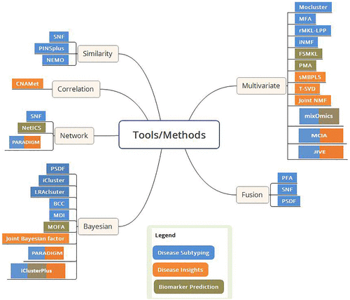

Further reading and information

- *Reading*
    - Subramanian I, Verma S, Kumar S, Jere A, Anamika K. Multi-omics Data Integration, Interpretation, and Its Application. Bioinform Biol Insights. 2020;14:1177932219899051. doi: [10.1177/1177932219899051](https://doi.org/10.1177/1177932219899051).
    - Santiago-Rodriguez TM, Hollister EB. Multi 'omic data integration: A review of concepts, considerations, and approaches. Semin Perinatol. 2021;45(6):151456. doi: [10.1016/j.semperi.2021.151456](https://doi.org/10.1016/j.semperi.2021.151456). 
    - Graw S, Chappell K, Washam CL, Gies A, Bird J, Robeson MS 2nd, Byrum SD. Multi-omics data integration considerations and study design for biological systems and disease. Mol Omics. 2021;17(2):170-185. doi: [10.1039/d0mo00041h](https://doi.org/10.1039/d0mo00041h)
    - Krassowski M, Das V, Sahu SK, Misra BB. State of the Field in Multi-Omics Research: From Computational Needs to Data Mining and Sharing. Front Genet. 2020;11:610798. doi: [10.3389/fgene.2020.610798](https://doi.org/10.3389/fgene.2020.610798).
-  *Online courses/material by EMBL-EBI*
    - [Introduction to multiomics data integration and visualisation](https://www.ebi.ac.uk/training/events/introduction-multiomics-data-integration-and-visualisation-virtual/)
    - [Introduction to multiomics data integration](https://www.ebi.ac.uk/training/events/introduction-multiomics-data-integration/)
    - [Systems biology: From large datasets to biological insight](https://www.ebi.ac.uk/training/events/systems-biology-large-datasets-biological-insight-0/)

---

# Multiomics data analysis

> **What is -omics?**
>A definition from [Krassowski et al. 2020](https://doi.org/10.3389/fgene.2020.610798)    
"Multi-omics, variously called integrated omics, pan-omics, and trans-omics, aims to combine two or more omics data sets to aid in data analysis, visualization and interpretation to determine the mechanism of a biological process."


[The wikipedia exert on "Omics"](https://en.wikipedia.org/wiki/Omics)    
"The branches of science known informally as omics are various disciplines in biology whose names end in the suffix -omics, such as genomics, proteomics, metabolomics, metagenomics, phenomics and transcriptomics. Omics aims at the collective characterization and quantification of pools of biological molecules that translate into the structure, function, and dynamics of an organism or organisms.    
The related suffix -ome is used to address the objects of study of such fields, such as the genome, proteome or metabolome respectively. The suffix -ome as used in molecular biology refers to a totality of some sort.    
Functional genomics aims at identifying the functions of as many genes as possible of a given organism. It combines different -omics techniques such as transcriptomics and proteomics with saturated mutant collections."

**Types of 'omic data maybe include**:

- Culturomics
- Epigenomics
- Genomics
- Glycomics
- Lipidomics
- Metabolomics
- Proteomics
- Transcriptomics

**Benefits of multi-omics data**

- Compensate for missing or unreliable information in any single data type
- The likelihood of false positive discoveries are reduced
- Better understanding of the complete biological model when considering different layers of interactions


```{r echo = FALSE, out.width = "75%", fig.cap= "Image from Subramanian et al. 2020 https://doi.org/10.1177/1177932219899051. Overview of multi-omics data integration tools. The tools/methods are grouped based on their approach and are color coded as per their applications. FSMKL indicates feature selection multiple kernel learning; JIVE, joint and individual variation explained; MCIA, multiple co-inertia analysis; MDI, multiple dataset integration; MFA, multiple factor analysis; MOFA, multi-omics factor analysis; NEMO, neighborhood based multi-omics clustering; PFA, pattern fusion analysis; PMA, penalized multivariate analysis; sMBPLS, sparse multi-block partial least squares; SNF, similarity network fusion; NMF, nonnegative matrix factorization; BCC, Bayesian consensus clustering; PSDF, patient-specific data fusion."}

```


---

# Workshop data

For this workshop we will be using a published data set that includes NMR and microbiomic information.

West KA, Kanu C, Maric T, et al. Longitudinal metabolic and gut bacterial profiling of pregnant women with previous bariatric surgery. Gut 2020;69:1452-1459. doi: [10.1136/gutjnl-2019-319620](http://dx.doi.org/10.1136/gutjnl-2019-319620)

We will make use of the *cleaned* dataset provided by the authors which they made available at the following repository link https://github.com/ka-west/PBS_manuscript.

---

# Glossary

Not exhaustive but just help as a guide with the many acronyms that exist in statistics.

- BCC, Bayesian consensus clustering; 
- CA, component analysis
- DISCO-SCA, simultaneous component analysis with rotation to common and distinctive components;
- FSMKL indicates feature selection multiple kernel learning; 
- ICA, independent Component Analysis;
- JIVE, joint and individual variation explained; 
- MCIA, multiple co-inertia analysis; 
- MDI, multiple dataset integration; 
- MFA, multiple factor analysis; 
- MOFA, multi-omics factor analysis; 
- MDS, multidimensional scaling;
- NEMO, neighborhood based multi-omics clustering; 
- NMF, nonnegative matrix factorization; 
- NPC, non-parametric combination;
- PCA, principal component analysis
- PFA, pattern fusion analysis; 
- PMA, penalized multivariate analysis; 
- PSDF, patient-specific data fusion;
- pESCA
- QC, quality control
- sMBPLS, sparse multi-block partial least squares; 
- SNF, similarity network fusion; 